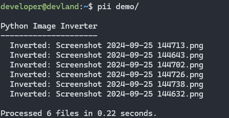

# Python Image Inverter

## Screenshot



## Description

Python Image Inverter is a simple CLI utility to invert color in images using Python and Pillow.

As a student, I prefer dark-mode and find myself manually inverting images for my notes so I am not blinded. Works for a single image or will convert any images found from a provided directory.

## Installation

1.  Open up a terminal and navigate to a directory where you want to save the project then using the following command to copy the repository:

    ```bash
    git clone https://github.com/iiTONELOC/python-image-inverter.git
    ```

2.  Next, run the installation script, this will create a virtual environment for the Pillow dependency (this prevents a global install on your machine) and adds an alias for invoking Python Image Inverter via the command line with the `pii` command.

    ```bash
    #via bash
    bash install.sh
    ```

    ```powershell
    #Windows via PowerShell
    .\install.ps1
    ```

## Usage

The program will accept a filename or a directory name as an argument when calling. If an argument is not provided, the user will be prompted to provide a file or directory for processing.

```bash
pii <file or directory>
```

### Examples

#### All Images in a Directory

```bash
pii ~/Downloads

Python Image Inverter
---------------------
  Inverted: Screenshot 2024-09-25 144632.png
  Inverted: Screenshot 2024-09-25 144643.png
  Inverted: Screenshot 2024-09-25 144702.png
  Inverted: Screenshot 2024-09-25 144713.png
  Inverted: Screenshot 2024-09-25 144726.png
  Inverted: Screenshot 2024-09-25 144738.png

Processed 6 files in 0.22 seconds
```

#### Single Image

```bash
pii "~/Downloads/Screenshot 2024-09-25 144632.png"

Python Image Inverter
---------------------
  Inverted: Screenshot 2024-09-25 144632.png

Processed 1 file in 0.11 seconds.
```


## LICENSE

This project is free to use and is licensed with an MIT license, [which you can find here](./LICENSE).
